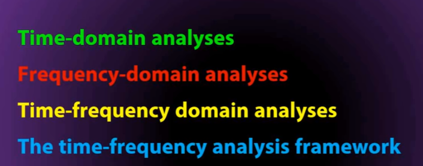
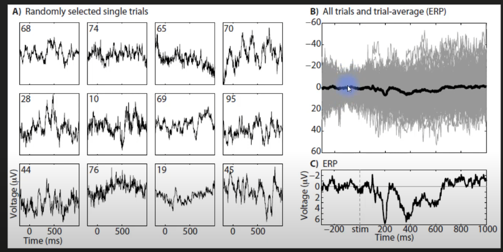
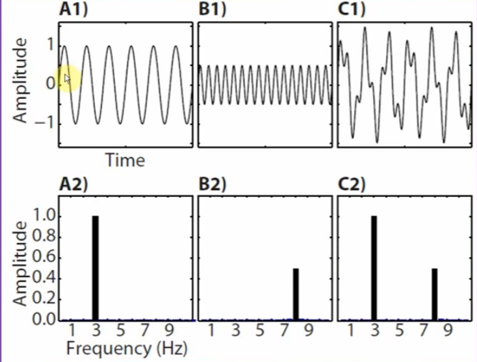
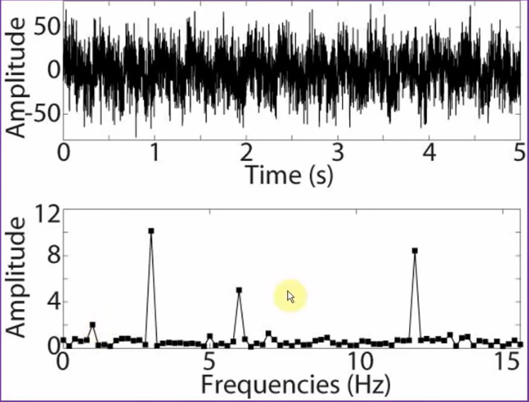
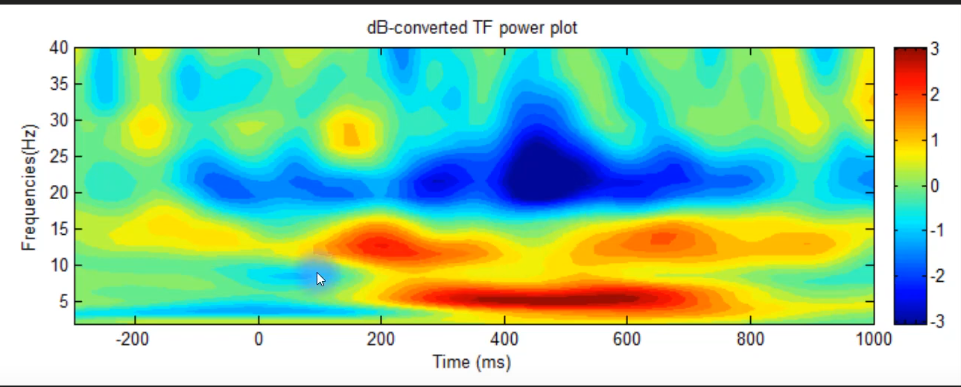
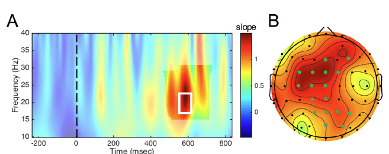
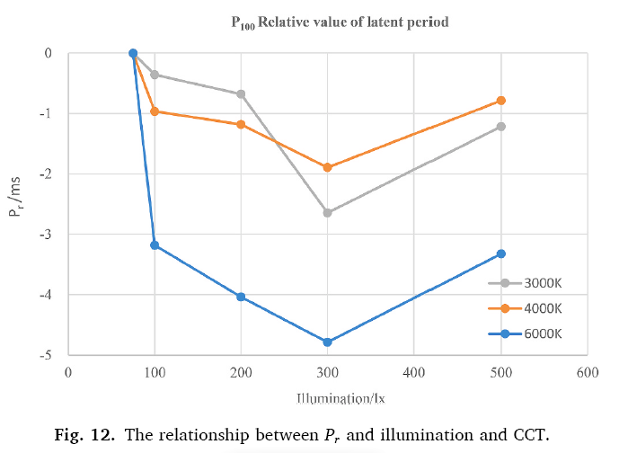

# Time-domain analyses
> Event related potentials (ERPs)

## Timing of Neural Responses

- **Latency**: The time from the onset of a stimulus to the occurrence of specific ERP components (like P300, N400, etc.) can be precisely measured. 
- The latency of these components reflects how **quickly** the brain processes different types of information.

## Strength and Magnitude of Responses

- **Amplitude**: The peak (positive or negative) amplitude of ERP components provides information about the strength of the brain's response to a stimulus. 
- Larger amplitudes typically indicate **stronger neural responses or greater allocation of cognitive resources to the task.**

## Cognitive and Neural Processes

- **Cognitive Functions**: Different ERP components are associated with specific cognitive functions. For example, the P300 component is often related to **attention and working memory processes**, while the N400 component is linked to **language comprehension and semantic processing**.
- **Brain Regions**: The distribution of ERP amplitudes across the **scalp** can provide information about the **brain regions** involved in processing the stimulus. This helps in understanding the neural networks and pathways engaged in cognitive tasks.

>- ***Potential research:*** compare difference in latency, strength of responses, and specific cognitive functions before and after adjusting individual perceived environments across different sensory stimuli

## Experimental Effects

- **Task Differences**: By comparing ERPs elicited in different experimental conditions or tasks, researchers can infer how cognitive processes differ across conditions or **how they are influenced by specific experimental manipulations.**
- **Individual Differences**: Analyzing variations in ERPs among individuals can help in understanding **individual differences** in cognitive processing and neural mechanisms.

# Frequency-domain analyses
 
  
# Time-Frequecy Analyses

> - Frequency Range: Beta waves usually fall within the frequency range of about 13 Hz to 30 Hz.
> - Cognitive Functions: Beta waves are often associated with active, busy, or anxious thinking and active concentration. Increased beta activity can be related to alertness, problem-solving, decision-making, and engaged attention.
>- ***Potential Hypothesis for future research:*** When users adjust environmental factors (such as lighting, noise level, and temperature) to what they consider the most comfortable state, they will exhibit increased gamma wave activity during memory tasks compared to a baseline environment, along with improved memory performance.
# 1. Pattern Reversal Visual Evoked Potential (PRVEP)
***Lu, M. et al. (2020) ‘Research on work efficiency and light comfort based on EEG evaluation method’, Building and Environment, 183(July), p. 107122. doi: 10.1016/j.buildenv.2020.107122.***
>Pattern Reversal Visual Evoked Potential (PRVEP) is a type of Event-Related Potential (ERP). PRVEP specifically refers to the ERP responses generated in the visual cortex of the brain in reaction to visual stimuli where a pattern (often a checkerboard) alternates between two phases, creating a "reversal" effect. This visual stimulation method is used to evoke electrical activity in the brain that is then recorded and analyzed to assess the functional integrity of the visual pathways from the retina through the optic nerves to the visual cortex.
### 视觉刺激呈现
* 刺激设置：使用特殊软件在显示器上呈现棋盘格模式。棋盘格模式会周期性地反转，即黑白格子互换.
* 视觉注视：受试者被要求注视显示器中心的一个固定点，以确保视觉刺激的一致性。
> Analysis: the P100 latent period at the level of 75 lx was taken as the standard value, and the standard value at the same colour temperature level was subtracted from the actual value of a working condition as the relative value, Pr, of the P100 latent period to describe the relationship between the response speed, illumination, and colour temperature. **When this value is positive, indicating that the P100 latent period is greater than the standard value, the rate of visual information transmission is relatively slow, and the working efficiency is low. On the contrary, when the latent period of P100 is smaller than the standard value, the rate of visual information transmission is relatively fast, and the working efficiency is high.**

* the Pr at the three colour temperature levels is always less than 0, and the inflection points all appear at 300 lx. 
* at the colour temperature of 6000 K, Pr is distinctly less than for the other two colour temperatures, indicating that with the increase in illumination, the visual acuity of all the staff improved, **but the amplitude tends to increase first and then decrease.** 
* under the combination of the 6000 K colour temperature and 300 lx illumination, the human optic nerve is the most sensitive.

## 观测ERP成分
- **何时考虑**：如果研究关注的是光照变化如何影响大脑对特定事件的即时反应，应考虑观测ERP成分。例如，研究光照如何影响对突然出现的视觉刺激的反应。
- **分析方法**：在这种情况下，应使用**时间域分析**，因为它可以准确地提供ERP成分（如P300、N400）的潜伏期和振幅信息，这些信息对于理解光照如何影响认知过程至关重要。

### 观测波段周期
- **何时考虑**：如果研究关注的是光照如何影响大脑在更长时间尺度上的活动模式，例如，研究光照对放松状态或长期注意力的影响，应考虑观测波段周期。
- **分析方法**：在这种情况下，**时间-频率分析**更为合适，因为它可以展示在整个实验期间内，不同频率波段（如alpha、beta、gamma波）活动的变化情况。这种分析可以揭示光照如何在时间和频率上影响大脑活动的动态变化。

### 具体应用

- **ERP分析**：当需要具体了解大脑对单一刺激事件的反应速度和强度时，应用时间域分析来提取和评估ERP成分。
- **波段周期分析**：当需要评估大脑在较长时间内对持续或变化的光照条件的反应时，时间-频率分析能够提供更全面的视角。

### 结论
- 选择适当的分析方法需根据研究的具体目标来决定。如果目标是评估特定事件的即时大脑反应，那么观测ERP成分并使用时间域分析是适合的。如果目标是理解长期或持续的环境变化如何影响大脑的活动模式，则观测波段周期并采用时间-频率分析会更加合适。

您的理解是有道理的。根据任务的性质和研究的目标，选择ERP测试或波段周期观测是有区别的。让我们详细探讨这两种情况：

### 反应力和注意力测试
- 对于测试反应力和注意力，ERP测试是非常适用的。因为这些任务通常需要受试者对特定的刺激或事件迅速做出反应，ERP成分（如P300）可以直接反映受试者对这些刺激的处理速度和效率。
- 在这种情况下，研究者会关注特定刺激后ERP成分的潜伏期和振幅，这些数据提供了关于受试者认知处理速度和注意力分配的直接信息。

### 记忆力测试
- 对于评估记忆力，观测脑电波的频率波段可能更加合适。记忆任务通常涉及到更长时间的认知过程，包括编码、存储和回忆信息。
- 在这种情况下，研究者可能会寻找在记忆任务期间活跃的特定频率波段，如theta波和gamma波，这些波段被认为与记忆形成和回忆过程有关。
- 时间-频率分析可以用来揭示记忆任务期间不同频率波段的活动变化，帮助研究者理解在记忆过程中大脑活动的动态变化。

### 结合使用ERP和波段周期观测
- 在某些复杂的研究设计中，同时使用ERP和波段周期观测可能会提供更全面的信息。例如，在一个涉及反应力、注意力和记忆力多个方面的认知任务中，结合两种方法可以更全面地理解大脑如何同时处理这些不同的认知需求。
- 通过ERP，研究者可以获得对特定事件反应的直接测量，而通过频率波段的分析，可以获得关于持续认知过程，如记忆编码和存储，的更深入理解。

总之，选择ERP测试还是波段周期观测，应基于任务的特性和研究目标。对于需要快速反应和注意力评估的任务，ERP成分提供关键信息；对于需要深入了解记忆过程和长期认知状态的任务，观测特定的频率波段可能更加适合。在一些情况下，结合两种方法将提供最全面的认知功能视图。
---
*Williams, N. S. et al. (2020) ‘A validation of Emotiv EPOC Flex saline for EEG and ERP research’. doi: 10.7717/peerj.9713.**
# 2. EEG Task load index (TLI) and EEG Task engagement index (TEI)
EEG任务负荷指数（Task Load Index, TLI）和EEG任务参与指数（Task Engagement Index, TEI）是通过分析脑电波（EEG）数据来评估个体在执行任务时的认知状态的指标。下面是这两个指数的计算方法和应用实例。

## EEG任务负荷指数 (TLI)

### 计算方法
- TLI通常与脑电图中的特定频率带有关，如theta波和alpha波的功率比。较高的theta/alpha比率可能表示较高的任务负荷。
- 公式例子：\( TLI = \frac{\text{theta power}}{\text{alpha power}} \)

### 应用实例
- **驾驶模拟**：在驾驶模拟研究中，TLI可以用来评估驾驶员在不同行驶条件下的认知负荷。例如，比较高速公路驾驶和城市街道驾驶的认知负荷。

## EEG任务参与指数 (TEI)

### 计算方法
- TEI通常定义为beta波功率与theta和alpha波功率之和的比率，反映了个体的警觉度和参与度。
- 公式例子：\( TEI = \frac{\text{beta power}}{\text{alpha power} + \text{theta power}} \)

### 应用实例
- **学习与教育**：在教育研究中，TEI可以用来评估学生在课堂上或在进行特定学习任务时的参与度。例如，测量学生在传统讲授法和互动式学习活动中的任务参与度。

### 两者的区别和联系
- TLI更多地关注于任务的认知负荷，而TEI关注于个体的警觉度和任务参与度。
- 虽然TLI和TEI是不同的指标，但它们都可以用来评估工作或学习环境中个体的认知状态。

在办公室设计或学校教育环境优化中，使用TLI（任务负荷指数）和TEI（任务参与指数）可以帮助找到更好的设计指标。这通常涉及差异性显著性分析来比较不同设计方案的效果。若要进行相关性分析，我们应该探索与TLI和TEI相关联的各种环境和行为指标。以下是一些可能的指标：

### 环境指标

1. **空间布局**：探索不同空间布局如何影响TLI和TEI，例如开放式办公环境与封闭式办公间的比较。
2. **光照条件**：分析光照水平（如自然光与人造光的比例）对员工或学生的任务负荷和参与度的影响。
3. **噪音水平**：评估背景噪音或声学设计如何影响认知负荷和警觉度。
4. **室内气候**：包括温度、湿度和空气质量等因素，研究它们对TLI和TEI的关联性。

### 行为指标

1. **工作效率**：测量不同环境设计下员工的工作效率和学生的学习效果，看其与TLI和TEI的相关性。
2. **满意度与幸福感**：通过问卷调查或访谈收集数据，了解员工或学生在不同环境下的满意度和幸福感，并探索这些因素与TLI和TEI的关系。
3. **压力和疲劳感**：评估环境设计对个体压力水平和疲劳感的影响，并分析这些心理状态与TLI和TEI的相关性。

### 设计相关任务

任务选择：选择或设计能够反映真实工作或学习情境的任务。这些任务应该能够衡量参与者的性能，如完成速度、准确率、创造力或解决问题的能力等。
任务相关性：确保任务与参与者的日常工作或学习活动相关联，这样得到的结果才能有效反映实际的工作效率或学习效果。

评估压力和疲劳感可以通过心理生理方法、自我报告问卷和行为观察等多种手段进行。这些方法可以帮助研究者和专业人士了解个体在特定环境条件下的心理和身体状态。以下是一些常用的评估方法：

### 心理生理方法

1. **生理指标监测**：
   - **心率变异性（HRV）**：测量心率的波动，可以反映个体的压力水平和自主神经系统的活动。
   - **皮电反应（GSR）**：测量皮肤电导率的变化，通常与情绪激动和压力水平相关。
   - **皮肤温度**：压力和紧张可能导致外周血管收缩，影响皮肤温度。

### 自我报告问卷

1. **压力和疲劳问卷**：
   - 使用标准化的心理测量工具，如压力感知量表（Perceived Stress Scale, PSS）或疲劳量表（如Profile of Mood States, POMS），来让参与者评估他们的压力和疲劳水平。
   - 健康问卷，如SF-36健康调查问卷，也可以用来评估与压力和疲劳相关的生活质量指标。

---
在受试者经历不同强度的光照条件下进行研究时，选择观测ERP成分还是波段周期，以及使用时间域分析（time domain analyses）还是时间-频率分析（time-frequency analyses），取决于研究的具体目标和假设。以下是如何根据研究目的决定分析方法：

